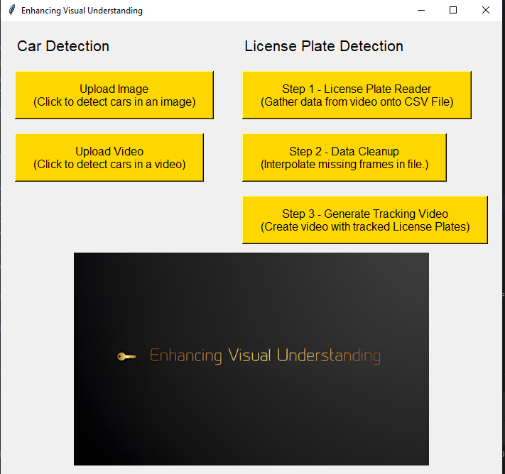
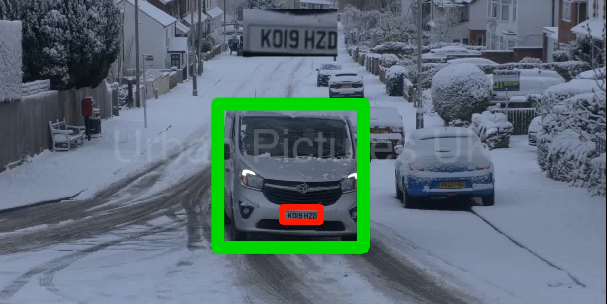
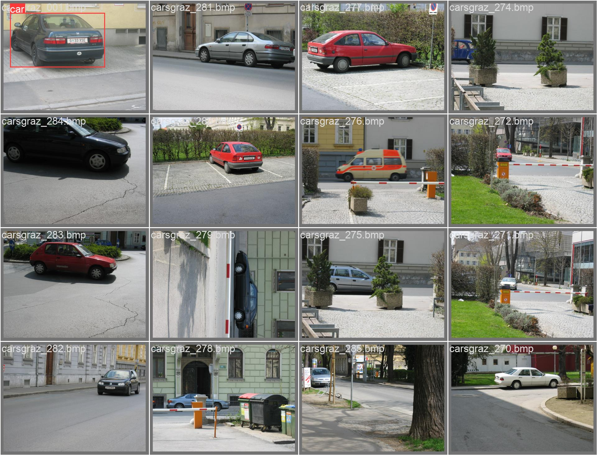
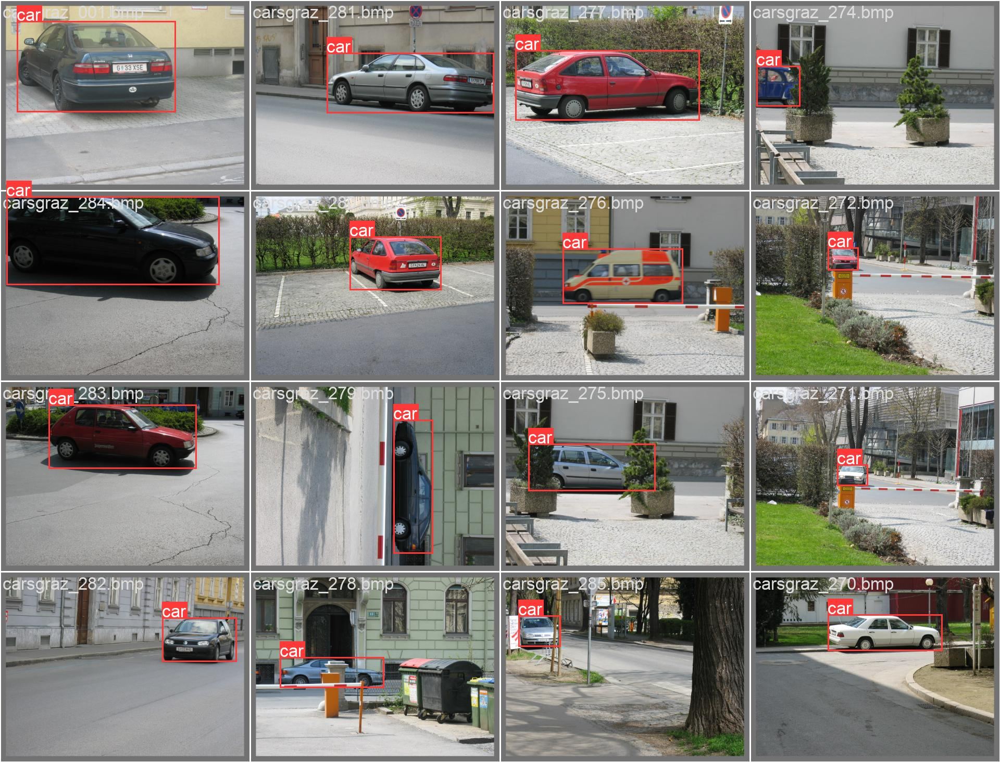
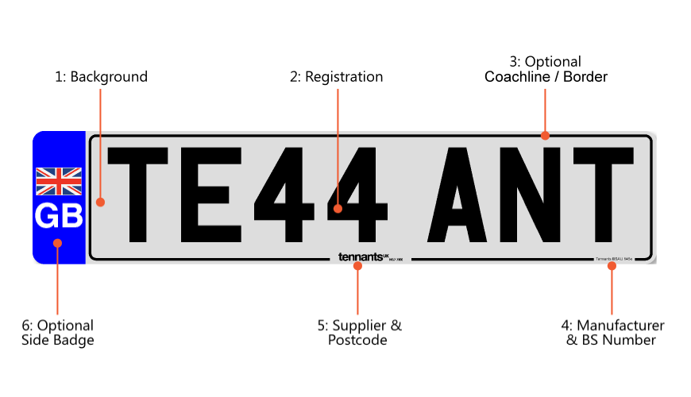

# Real-Time Car and License Plate Detection System

## Overview

Welcome to the Real-Time Car and License Plate Detection System! 

This project implements a powerful real-time car and license plate detection system using deep learning and computer vision techniques. The system is capable of identifying vehicles and extracting license plates from video feeds, achieving high accuracy with both trained and untrained AI models. It supports multiple license plate formats, including UK-style plates, and can be easily extended for use in various applications such as traffic monitoring, security, and automated toll systems.

## Features

- **Real-Time Detection:** Detects cars and license plates in live video streams.
- **High Accuracy:** Utilizes state-of-the-art models for accurate detection.
- **Intermediate detection stages:** To visualize how the model improves during training.
- **Support for multiple license plate formats**: including UK plates.
- **Customizable** for various real-world applications like traffic management and surveillance.
- **Easy to Use:** Simple setup and usage instructions.

## Technologies Used
- **Python**
- **OpenCV**
- **YOLOv8 for object detection**
- **TensorFlow/PyTorch for model training**
- **Git LFS for managing large files**

## Installation

To get started, clone this repository and install the required dependencies:

```bash
git clone https://github.com/Paull-o/Real-Time-Car-and-Licence-Plate-Detection-System.git
cd Real-Time-Car-and-Licence-Plate-Detection-System
pip install -r requirements.txt 
```

## Usage

To run the detection script, use the following command:

```bash
python main.py --video path/to/video.mp4
```
Replace path/to/video.mp4 with the path to your video file.

## Screenshots

Here are some screenshots that demonstrate the system in action:

### Interface



*This screenshot showcases the main user interface of the Real-Time Car and License Plate Detection System.*

### Sample Video Untracked


*This image shows how the system detects cars and license plates without tracking, providing a comparison to the tracked version.*

### Sample Video Tracked



*This screenshot shows the detection of cars and license plates in a video with tracking enabled, highlighting real-time detection.*

### Untrained AI Detection


*This screenshot highlights the initial detection capabilities of the AI before training, showing room for improvement.*

### Mid-Trained AI Detection



*The system's detection results after partial training. It shows how well the AI performs during intermediate stages of training.*

### Fully Trained AI Detection



*This screenshot demonstrates the performance of the AI after full training, achieving high accuracy in detecting vehicles.*

### UK License Plate Detection



*This image displays the UK-style license plate that was used for the system to detect license plates, showcasing its versatility in handling various formats.*


## License

This project is licensed under the MIT License. See the LICENSE file for details.

## Contributing

If you'd like to contribute to this project, please follow these steps:

1. **Fork the repository.** 
2. **Create a new branch** (git checkout -b feature/your-feature).
3. **Make your changes and commit them** (git commit -am 'Add new feature').
4. **Push to the branch** (git push origin feature/your-feature).
5. **Create a new Pull Request.**


## Contact

For any questions or feedback, please contact Paull-o.
